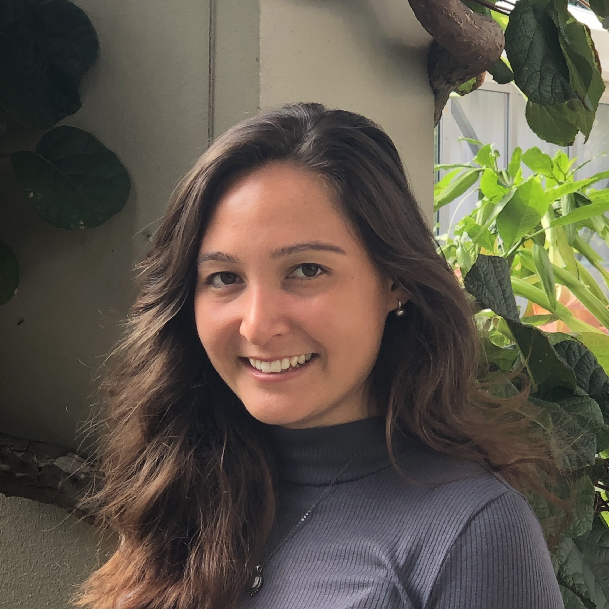

## About Me

Hi There! 
I am an MPH Epidemiology student at the Mailman School of Public Health at [Columbia University](https://www.publichealth.columbia.edu/academics/departments/epidemiology). 
I am currently an intern at the New York City Department of Health and Mental Hygiene, where I work on foodborne disease surveillance. 

## Learn More
Learn about my experience on [LinkedIn](https://www.linkedin.com/in/karina-myers-268a99b1/) and [here!](about.html)

